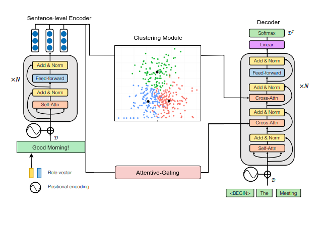
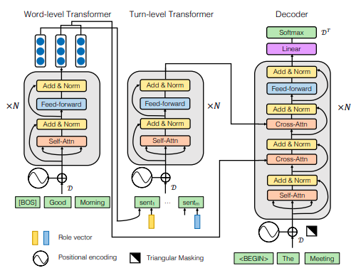

# Meeting-Summarization
Leveraging <b>extractive summarization</b> techniques for <b>abstractive summarization.</b> 

There exist a large number of meetings in the form of university lectures, business conferences, academic talks, interviews, etc. Each contain enormous amount of text in the form of conversations between multiple participants with varying levels of importance or influence.  
Lectures are a great example wherein transcripts, although readily available, are usually long and difficult to even skim through. As students, having a summary of the entire lecture, consisting of not only the lecturer's material but also the doubts asked and answers given by the students would be very convenient.  
The same applies to business conferences, where multiple employees and associates speak, each from a different department or having a different role in the company. It is important to not only summarize the transcripts but also take into account which participant says what(or what role they are assigned). Role based summarization provides more context to the summary, thus producing better representation.  

This repository provides a solution by levaraging extractive summarization techniques for abstractive summarization of meetings. The solution is inspired by the architecture proposed in [[1]](#1) and clustering based extractive summarization techniques in [[2]](#2).

[[1]](#1) proposes a novel architecture named HMNet, a transformer based architecture with 2 encoders and a decoder. The 1st encoder encodes the plain text of the meeting and the 2nd encoder incorporates 'role' information of the speakers/participants. These are then inputted to the decoder to generate the final summary. The model is pretrained on the CNN/DailyMail dataset and then trained and tested on the AMI and ICSI meeting corpus. 

[[2]](#2) makes use of extractive text summarization by utilizing the BERT model for sentence embeddings and K-Means clustering to identify sentences closest to the centroid for summary selection. The top 'n' sentences are then selected as part of the summary. 

- The proposed model incorporates both the above ideas by making the summary in the decoder attend not only to the role-based meeting text but also the 'n' top ranked turns/sentences of the meeting.
- This provides the decoder with more important information from the meeting so that their meaning can be incorporated into the summary. 
- The turn-level encoder is replaced by the clustering module which returns the top 'n' sentences based on the number of clusters formed.
- Moreover, sentence embeddings are used as input to the encoder instead of word embeddings(used by HMNet) which help in clustering and also reduce dimensionality for the otherwise large meeting samples.
- The role vector is concatenated to the sentence-level encoder instead of the turn-level encoder(which is removed altogether) as sentence embeddings already encode the textual information aptly.

Proposed Model            |  HMNet
:-------------------------:|:-------------------------:
  |  

## References
<a id="1" href="https://www.microsoft.com/en-us/research/publication/end-to-end-abstractive-summarization-for-meetings/">[1]</a> 
Zhu, Chenguang and Xu, Ruochen and Zeng, Michael and Huang, Xuedong. 2020. A Hierarchical Network for Abstractive Meeting Summarization with Cross-Domain Pretraining. <i>Proceedings of the 2020 Conference on Empirical Methods in Natural Language Processing</i>
 
<a id="2" href="https://arxiv.org/abs/1906.04165">[2]</a> 
Derek Miller. 2019. Leveraging BERT for Extractive Text Summarization on Lectures

